# A simple auction site with Microservices 
This is a simple auction site that adopt microservices architecture with event based communication between services. 

### Tech Stack
- .Net Core 2.0
- Hangfire
- MongoDb
- [Pusher](https://pusher.com/)
- React/Redux

### Architecture Graph


### Start Solution
```sh
$ docker-compose -f docker-compose.yml -f docker-compose.override.yml up
```
The default web URL is http://localhost:3000

### Run Frontend Tests 
```sh
$ cd E8ay.Web
$ npm install
$ npm test
```

### Run Backend Tests 
```sh
$ cd test
$ test.bat (Windows)
or
$ ./test.sh (Linux)
```
### Data Seed
For demo purpose, every time the app restart, all the data will be wiped and new auction items and users will be seeded.
Please use the following credential to login:

| Username | Password |
|----------|----------|
| user1    | password |
| user2    | password |


### Limitations
- Automation tests only cover the auction core workflow business logic
- Clock syncing between server and client
- Production docker config
- Configuration for various environment variable
- Other site functionality (i.e. user registration, create auction items)